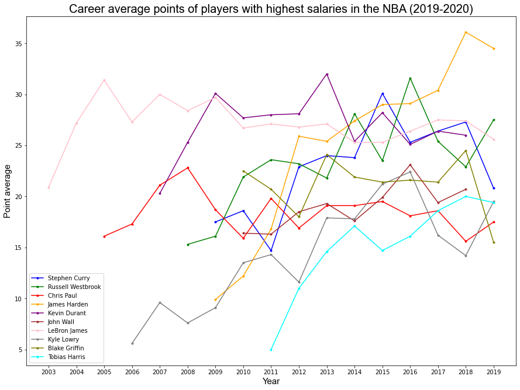

# Scorers get paid - Basketball (pipelines project) 

This is the second project I have done during the IronHack data analytics bootcamp. The task was to analyze a dataset, adding information from an API or through web scraping. 

The datased I selected is the [NBA Player Data](https://www.kaggle.com/justinas/nba-players-data), and the sources I used to get more information are [Balldontlie API](https://www.balldontlie.io/#introduction) and two csv files from Baskeball Reference: [2019-20 Los Angeles Lakers Schedule and Results](https://www.basketball-reference.com/teams/LAL/2020_games.html) and [LeBron James 2019-20 Game Log](https://www.basketball-reference.com/players/j/jamesle01/gamelog/2020/). 

The libraries I used for the analysis are: 
- [requests](https://docs.python-requests.org/en/master/) to make the requests from the API 
- [pandas](https://pandas.pydata.org/docs/user_guide/index.html) to create the dataframes 
- [json](https://docs.python.org/3/library/json.html) to navigate through the information from the API 
- [os](https://docs.python.org/3/library/os.html) to use bash commands in python
- [seaborn](https://seaborn.pydata.org/index.html) and [matplotlib](https://matplotlib.org/stable/contents.html) to make the visualizations

I focused on the scoring of the players and, among other visualizations, I made this graph showing the career scoring averages of the ten players with the higher salaries on the 2019-2020 season. 

