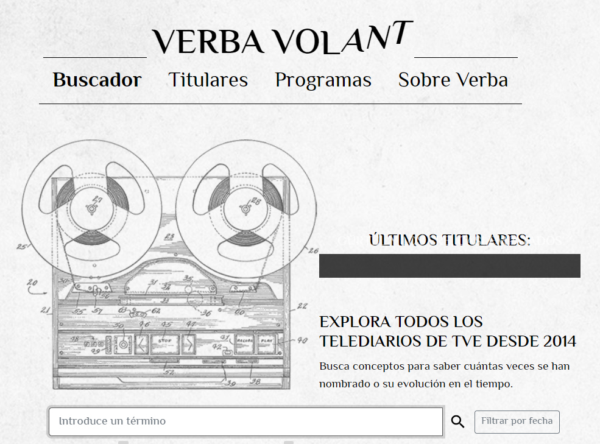

# Final Project

This is my final project of the IronHack Data Analytics Bootcamp.  I performed an analysis of the regional elections, focusing in the electoral programs of the main six political parties (PP, Más Madrid, PSOE, Vox, Unidas Podemos and Ciudadanos. 

Using NLTK and Spacy, I identified the most used verbs (applying the lemmatization) and nouns (getting the ‘text’ tag). 

As there were some minor errors in the entity recognition, I also performed the analysis doing the code myself. 

The following wordcolud shows an example of the results of the latter, using the program of PP, who won the elections. 

Besides, I also analyzed the subtitles of the news in the Spanish public broadcaster TVE. In order to get the data, I used the [Verba](https://verba.civio.es/) of the [Civio](https://civio.es/) foundation. 

“The Civio Foundation (Fundación Ciudadana Civio) is an independent, non-profit organization based in Spain which monitors public authorities, reports to all citizens and lobbies to achieve true and effective transparency within our institutions.”

The objective  of the project was to see if there was a significant influence of what the programs say (which shows which topics are important for the parties) and what was discussed on TV.  

Despite having relations, the same procedure should be applied to the transcriptions of the rallies and statements of the parties, as they have a bigger influence on the media. This would be a next step for this project, as an option to improve it in the future. 

Libraries

- [plotly 4.14.3](https://plotly.com/python-api-reference/plotly.express.html) 
- [pandas 1.1.5](https://pandas.pydata.org/docs/index.html)
- [matplotlib 3.3.4](https://matplotlib.org/)
- [numpy 1.19.5](https://numpy.org/doc/)
- [wordcloud 1.8.1](https://amueller.github.io/word_cloud/)
- [spacy 3.0.6](https://spacy.io/api/doc)
- [requests 2.25.1](https://docs.python-requests.org/en/master/)
- [beautifulsoup4 4.9.3](https://www.crummy.com/software/BeautifulSoup/bs4/doc/)
- [nltk 3.6.2](https://www.nltk.org/)
- [Pillow 8.2.0](https://pillow.readthedocs.io/en/stable/)
- python-dotenv 0.17.1
- [selenium 3.141.0](https://www.selenium.dev/documentation/en/)
- [SQLAlchemy 1.4.15](https://docs.sqlalchemy.org/en/14/)
