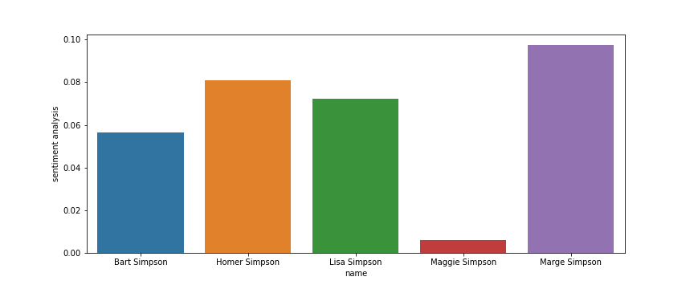
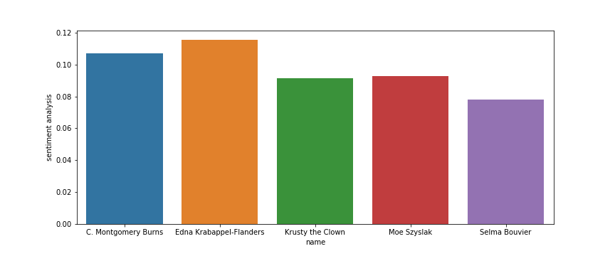

# Sentiment_analysis_project

This API is was made on the weekend of the sixth week project in Ironhack. The objectives of the project where to create an API with GET and POST methods and to perform a sentiment analysis with the responses of the API. 

The source of the data is the Kaggle [The Simpsons Dataset](https://www.kaggle.com/prashant111/the-simpsons-dataset), and the database was created using SQL.

The database has two tables: the first one is formed by the characters and their IDs, and the second one has the ID of the phrase, the episode ID, the ID of the character speaking and the phrase itself. 

### Endpoints

In order to get the information from the database, add the following endpoints to the http://0.0.0.0:5000/ url. 

- /names = returns a json file with all the character names in the database.

- /names/<name> = returns a json file with selected name (to check if it is in the database).

- /phrases = returns a json file with all the phrases in the database.

- /phrases/<name> = returns a json file with the phrases said by a selected character.

- /episodes = returns a json file with the IDs of the episodes (to check if they are in the database).  
    
- /episode/<num> = returns a json file with the phrases and the name of the character of a selected episode.

- /last_id = returns a json file with the character ID in the database (to check in case someone wants to include a new phrase said by a new character).   

    
The following endpoints can be used to insert info in the database. 
  
- /new_character/<name> = to insert a new name. (In case the user tries to insert a name that is already included, it will seem it was added but the request is ignored).
  
- /new_phrase = to include a new phrase. In this case the parameters episode_id, character_id and phrase must be included:

http://0.0.0.0:5000/new_phrase?episode_id=658&character_id=6751&phrase=Hello%20everybody

### Sentiment analysis

Sentiment analysis is a natural language processing technique applied in text and used to determine whether data is positive, negative or neutral.

In this case I performed the sentiment analysis on Homer, Marge, Bart, Lisa and Maggie. 
    
 

I decided to perform the same analysis on Moe, Selma, Montgomery Burns, Edna Krabappel and Krusty the clown, expecting a negative result. However, surprisingly the result was the following:
    

### Libraries

- `flask`
- `sqlalchemy`
- `dotenv`
- `getpass`
- `pandas`
- `requests`
- `json`
- `numpy`
- `seaborn`
- `matplotlib`
- `nltk`
