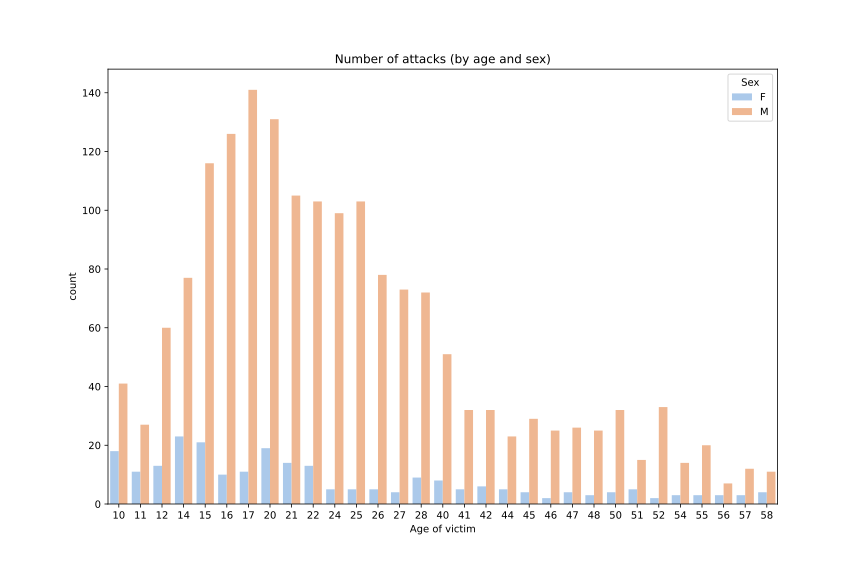

# Shark_Attack_Project - Data cleaning & wrangling

This is my first data analysis project. It was the first analysis of the bootcamp, made using python pandas. 

We used a csv file with attacks of sharks registered all over the world. The dataframe was quite messy and required a lot of cleaning. 

As this was an individual assignment, in order to be able to carry out the job, I focused on two main hipothesis. 

## 1. Are sex and age factors that influence the possibility of an incident with a shark?

### 1st Hypothesis: Men have more susceptible of having an incident with a shark

### 2nd Hypothesis:  Boys and young men have more incidents with sharks

### 3rd Hypothesis: Young men have more fatal incidents with sharks

## 2 - Which are the activities with more attacks?

### 1st Hypothesis: Surfing is the activity with most non-fatal shark attacks

### 2nd Hypothesis: Spearfishing is the activity with the highest amount of fatal attacks

The most interesting finding is the large difference between the number of attacks, when differentiated by sex. 

